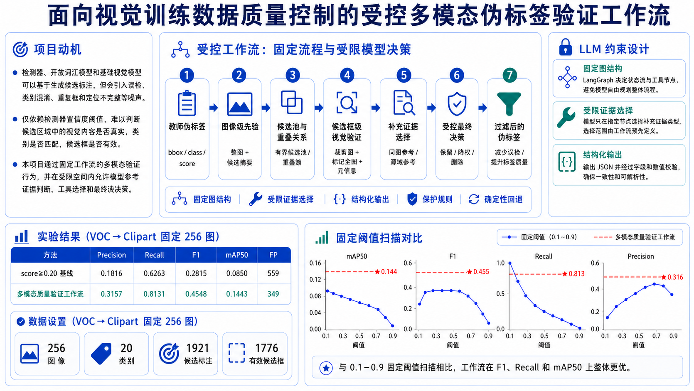
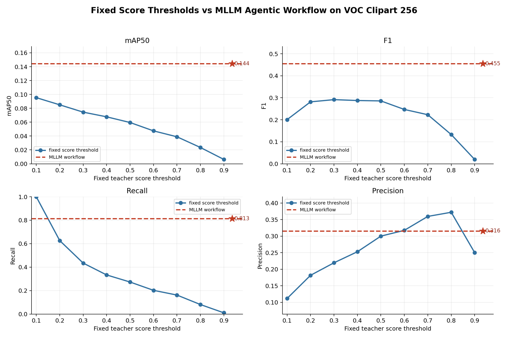

# 面向视觉训练数据质量控制的受控多模态伪标签验证工作流



## 1. 项目简介

本项目构建了一个面向视觉训练数据质量控制的受控多模态伪标签验证工作流。系统不让 LLM 自由规划完整流程，而是通过固定 LangGraph 工作流规定数据流、工具节点、模型输入输出格式和回退逻辑；同时在图像级先验、候选框级视觉验证、补充证据选择和最终决策等节点给予模型受限自由度。

该 demo 面向 VOC 到 Clipart 的伪标签质量验证任务，使用本地部署的多模态模型参与视觉证据判断，并通过离线评估验证过滤后伪标签质量。

## 2. 当前 Demo 设置

| 项目 | 内容 |
|---|---:|
| 任务 | VOC -> Clipart 伪标签筛选 |
| 图像数量 | 256 |
| 类别数量 | 20 |
| 候选标注总数 | 1921 |
| 有效候选框 | 1776 |
| 有效目标数 | 198 |
| 对比基线 | score >= 0.20 |

有效候选框指排除退化候选后，可形成合法视觉输入并进入正式评估统计的候选框。

## 3. 核心工作流

```text
教师伪标签
-> 图像级先验
-> 候选池与重叠关系
-> 候选框级视觉验证
-> 补充证据选择
-> 受控最终决策
-> 过滤后的伪标签
```

系统使用固定 LangGraph 控制流程。LLM 只在预定义节点上输出结构化 JSON；补充证据工具选择被限制在 allowlist 内，非法输出会回退到固定策略。

## 4. 核心结果

| 方法 | Precision | Recall | F1 | mAP50 | FP |
|---|---:|---:|---:|---:|---:|
| score >= 0.20 基线 | 0.1816 | 0.6263 | 0.2815 | 0.0850 | 559 |
| 多模态质量验证工作流 | 0.3157 | 0.8131 | 0.4548 | 0.1443 | 349 |



## 5. 文档入口

- 完整技术说明：[docs/MLLM_PseudoLabel_Workflow_Demo.md](docs/MLLM_PseudoLabel_Workflow_Demo.md)
- 案例追踪：[examples/](examples/)
- 运行摘要：[artifacts/run_outputs/](artifacts/run_outputs/)
- 代码运行说明：[CODE_USAGE.md](CODE_USAGE.md)

## 6. 边界说明

- 目标域 GT 只用于离线评估，不进入 prompt 或模型输入。
- 当前系统是固定工作流中的受限模型决策，不是自由 agent。
- 当前 demo 尚未接入真实训练反馈闭环。

## 7. 代码入口

开源包中的核心代码位于：

```text
mllm_pseudolabel_workflow/
```

可运行入口：

```bash
python -m mllm_pseudolabel_workflow.scripts.run_workflow_demo_256 --mode deterministic_gate_256 --limit 2
```
